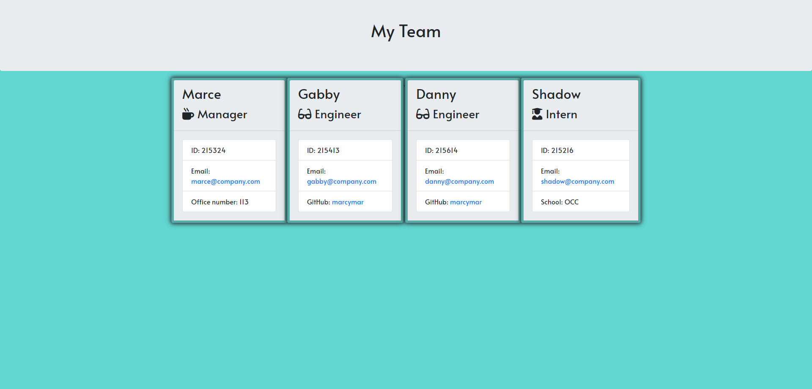

# Team Builder

---
### The goal for this assignemt was to create an application for someone to enter in information about employees and have it generate an HTML page showing cards with the employee's information.  This would also be different imformation depending on if they were a manager, engineer or intern.
---
## Table of Contents

[Usage](#usage)

[Questions](#questions)

---

## Usage
This was made using HTML, CSS, JS and the npm Inquirer.
    
## Questions
You can find me [on Github](github.com/marcymar) under the username: marcymar.

Demonstration video of [the app.](https://www.youtube.com/watch?v=8XA5DtMD-qg&feature=youtu.be)

Photo of the HTML page deployed: 
